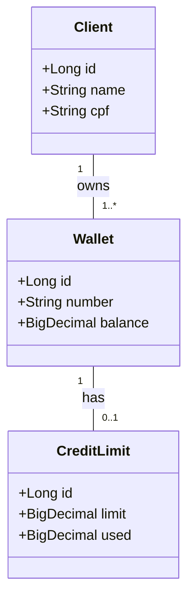

# Santander Dev Week 2025 - Simplified (Gradle, Java 17, H2)

Projeto simplificado inspirado em: rodrigodslima/santander-dev-week-2025

## Estrutura
- Gradle (Java 17)
- Spring Boot (Web + Data JPA)
- Banco em memória H2
- Pacotes: controller, service, repository, model

## Mermaid - Diagrama de classes


## Como executar
```bash
./gradlew bootRun
```
A aplicação sobe em `http://localhost:8080` e o console H2 ficará disponível em `/h2-console` (URL: jdbc:h2:mem:testdb).

Endpoints principais (exemplos):
- `GET /api/clients`
- `POST /api/clients`
- `GET /api/wallets`
- `POST /api/wallets`
- `GET /api/credit-limits`

## Observações
Projeto propositalmente simples para estudo e extensão. Sinta-se livre para pedir alterações (ex.: adicionar DTOs, validação, testes, Dockerfile, etc).
